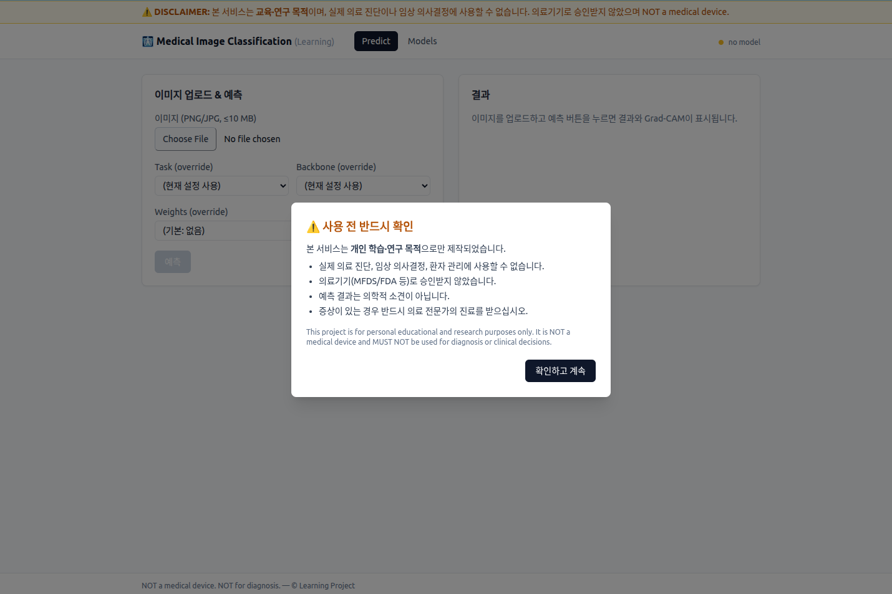

# Medical Image Classification (Learning Project)

> ## ⚠️ DISCLAIMER — 반드시 읽어주세요
>
> **본 프로젝트는 개인 학습·연구 목적으로만 제작되었습니다.**
> - 실제 의료 진단, 임상 의사결정, 환자 관리에 **사용할 수 없습니다**.
> - 의료기기(MFDS/FDA 등)로 승인받지 않았습니다.
> - 본 프로젝트의 예측 결과는 **의학적 소견이 아니며**, 어떠한 의료 행위의 근거로도 사용될 수 없습니다.
> - 실제 증상이 있는 경우 반드시 의료 전문가의 진료를 받으십시오.
>
> **This project is for personal educational and research purposes only.**
> It is NOT a medical device and MUST NOT be used for diagnosis or clinical decisions.

---

## 개요



공개 의료 영상 데이터셋(NIH ChestX-ray14 / ISIC 2019)을 활용한 분류 모델을
**TensorFlow 학습 파이프라인 + FastAPI 추론 서비스 + React 단일사용자 MVP UI** 로
구성한 풀스택 학습 프로젝트. RTX 4060 8GB 환경에서 학습 가능하도록 mixed
precision / gradient accumulation / OOM 자동 폴백을 적용한다.

- **CLI**: `backend/main.py` — download / train / eval / predict
- **API**: `backend/app.py` (FastAPI) — `/api/health`, `/api/tasks`, `/api/models`, `/api/predict`
- **UI**: `frontend/` (React 18 + Vite 5 + Tailwind) — 업로드 → 예측 → Grad-CAM
- **자동 부트스트랩**: 가중치가 없으면 서버 시작 시 합성 mini CXR로 1+1 epoch 학습(데모용)

## 저장소 구조

```
medical_image_classification/
├── README.md / LICENSE / NOTICE
├── docs/                              # 풀스택 아키텍처 문서
│   ├── architecture.md
│   └── uml.md                         # Mermaid 다이어그램
├── backend/                           # TensorFlow + FastAPI
│   ├── app.py                         # FastAPI 진입점 (lifespan / CORS / StaticFiles)
│   ├── main.py                        # CLI 진입점
│   ├── config.json                    # 단일 설정 (validate_config로 검증)
│   ├── api/routes/                    # health / tasks / models / predict
│   ├── services/                      # inference (cache+lock), bootstrap (synthetic)
│   ├── model.py / data_processor.py / trainer.py / evaluator.py / predictor.py
│   ├── dataset_downloader.py / utils.py
│   ├── requirements.txt
│   ├── tests/                         # pytest
│   ├── dataset/ models/ uploads/ logs/ results/   (gitignored 산출물)
└── frontend/                          # React + Vite + Tailwind (단일 사용자 MVP)
    ├── package.json / vite.config.ts
    └── src/{App,main}.tsx + pages/ + components/ + api/
```

## 지원 태스크

| Task | 데이터셋 | 분류 | 라이선스 |
|---|---|---|---|
| `nih_cxr_binary` | NIH ChestX-ray14 | Pneumonia 이진 | Public Domain |
| `isic_multiclass` | ISIC 2019 | 피부병변 7-class | CC-BY-NC 4.0 (비상업) |

## 백본 모델 (모두 Apache 2.0 / MIT)

- **EfficientNetB0** (기본 권장, ~5.3M params)
- MobileNetV2 (~3.5M params)
- ResNet50 (~25M params)

## 환경

- Python 3.9+ (개발/검증: 3.9.21)
- TensorFlow 2.10 (GPU)
- tensorflow-addons 0.18.0 (AdamW + X-ray 회전 증강)
- FastAPI / uvicorn (단일 사용자 MVP)
- Node.js 18.18+ / Vite 5 / React 18 / Tailwind 3
- CUDA 11.2 / cuDNN 8.1
- GPU: RTX 4060 8GB 기준 최적화

권장 conda env: `py39_tf` (TF 2.10 GPU 빌드 호환).

## 설치

### 백엔드

```bash
# (선택) 권장 환경 사용
conda activate py39_tf

cd backend
pip install -r requirements.txt
```

### 프론트엔드

```bash
cd frontend
npm install
```

## 실행

### 1) 풀스택 (API + UI)

두 터미널을 띄워 동시에 실행한다. Vite dev 서버가 `/api`, `/static` 을
백엔드(`:8000`)로 프록시하므로 브라우저에서는 same-origin 으로 호출된다.

```bash
# 터미널 A — FastAPI
cd backend
uvicorn app:app --reload --port 8000

# 터미널 B — Vite
cd frontend
npm run dev      # http://localhost:5173
```

서버 최초 기동 시 `backend/models/` 에 가중치가 없으면 **합성 mini CXR로
자동 부트스트랩 학습** 이 수행된다(`services/bootstrap.auto_bootstrap`).
결과 가중치는 데모/파이프라인 검증용이며 **임상적 의미는 없다**.

브라우저에서:
- `/predict` — 이미지 업로드 + task/backbone/weights override + Grad-CAM 결과
- `/models` — `backend/models/**/*.weights.h5` 스캔 결과

### 2) CLI (학습/평가/예측)

모든 CLI는 `backend/` 에서 실행한다.

```bash
cd backend

# 1. 데이터셋 다운로드 (라이선스 동의 필요)
python main.py --mode download --task nih_cxr_binary --agree
python main.py --mode download --task isic_multiclass --agree

# 2. 학습 (백본 옵션)
python main.py --mode train --task nih_cxr_binary --backbone EfficientNetB0

# 3. 평가 (test split 메트릭 + 시각화)
python main.py --mode eval --task nih_cxr_binary \
    --weights models/<run_dir>/stage2/best.weights.h5

# 4. 추론 + Grad-CAM 시각화
python main.py --mode predict \
    --image sample.png \
    --weights models/<run_dir>/stage2/best.weights.h5
# 디렉토리 일괄:
python main.py --mode predict \
    --input_dir samples/ \
    --weights models/<run_dir>/stage2/best.weights.h5
```

## HTTP API 요약

| Method | Path | 설명 |
|---|---|---|
| GET | `/api/health` | TF/GPU 상태, 현재 task/backbone, 로드된 모델 키, disclaimer |
| GET | `/api/tasks` | 지원 task 메타 + `available_backbones` |
| GET | `/api/models` | `backend/models/**/*.weights.h5` 스캔 결과 |
| POST | `/api/predict` | multipart: `file` + optional `task`/`backbone`/`weights`. 응답에 Grad-CAM URL 포함 |
| GET | `/static/results/<run>/<file>` | Grad-CAM PNG 정적 서빙 (uploads/ 는 노출하지 않음) |

업로드 제약: `PNG/JPG/JPEG`, 10 MB 이하. CORS는 dev `localhost:5173` 한정.

상세 흐름은 [`docs/architecture.md`](docs/architecture.md) 와
[`docs/uml.md`](docs/uml.md) (Mermaid sequence/state/activity 다이어그램) 참고.

## RTX 4060 8GB 기본 프로파일

| 항목 | 값 |
|---|---|
| 이미지 크기 | 256 (NIH) / 224 (ISIC) |
| Batch size | 16 × accum 2 = 유효 32 |
| Mixed precision / XLA | fp16 / on (predict 모드는 자동 fp32) |
| 예상 VRAM | ~5–6 GB |

OOM 발생 시 trainer가 자동으로 batch_size를 반감시켜 재시도(최대 2회).
그래도 실패하면 `batch_size=8` 또는 `gradient_checkpointing=true`로 수동 조정.

## 학습 안정화 옵션 (backend/config.json)

| 키 | 기본 | 설명 |
|---|---|---|
| `oversample` | true | 각 클래스를 분리 후 균등 weights로 sample_from_datasets (binary·multiclass 공용) |
| `focal_alpha_auto` | true | 클래스 분포 기반 focal α 자동 산출 (binary: 스칼라, multiclass: per-class 벡터) |
| `focal_gamma` | 3.0 | 불균형이 심할수록 ↑ (2.0–4.0) |
| `dropout` | 0.5 | head dropout |
| `l2_reg` | 1e-4 | Dense logits L2 정규화 |
| `cache_dataset` | false | 메모리 여유 시 tf.data cache |
| `fine_tune_at` | dict (per-backbone) | 백본별 freeze 경계. 작을수록 공격적 unfreeze |

`fine_tune_at` 예시:
```json
{
  "fine_tune_at": {
    "EfficientNetB0": 200,
    "MobileNetV2": 110,
    "ResNet50": 140
  }
}
```

## 데이터셋 라이선스

- **NIH ChestX-ray14**: U.S. NIH Clinical Center 공개, Public Domain.
  https://nihcc.app.box.com/v/ChestXray-NIHCC
- **ISIC 2019**: CC-BY-NC 4.0, 비상업적 연구 목적만 허용.
  https://challenge.isic-archive.com/data/#2019

다운로드 스크립트 실행 시 라이선스 고지문 출력 후 `--agree` 플래그로 동의를 확인합니다.

## 알려진 한계

- 인증/멀티유저 없음 — **단일 사용자 MVP** 가정. 운영 환경에 그대로 노출 금지.
- 자동 부트스트랩 가중치는 합성 데이터(우폐 패치) 기반 — 임상적 의미 **0**. UI 동작 검증 용도만.
- NIH Pneumonia 이진은 라벨 노이즈(텍스트 마이닝 weak label)와 양성률 ~1% 불균형으로 AUROC 0.6 내외가 현실적 상한.
- ISIC split은 `ISIC_2019_Training_Metadata.csv` 의 `lesion_id` 가 있을 때 lesion-level grouped split을 적용해 동일 lesion의 이미지가 split 사이에 흩어지지 않도록 보장(`dataset_downloader._isic_lesion_group_split`). 메타데이터가 없으면 image-level fallback이며 이 경우 메트릭이 낙관적으로 편향될 수 있음.
- `GradAccumModel` 은 단일 GPU 전용 (`num_replicas_in_sync > 1` 이면 `RuntimeError`).
- 예측 입력은 `.png/.jpg/.jpeg` 만 지원 (DICOM/NIfTI 미지원).

## 테스트

```bash
cd backend
pytest tests/
```

## 라이선스

본 프로젝트 소스 코드는 학습 목적 공개. 데이터셋과 사전학습 가중치는 각자의 원본
라이선스를 따릅니다 (`NOTICE` 참조).
