# UML Diagrams

> Mermaid 기반 다이어그램. GitHub/IDE 미리보기에서 그대로 렌더링된다.
> 풀스택(React ↔ FastAPI ↔ TF 파이프라인) 전체를 다룬다.

## 1. Component Diagram (Full Stack)

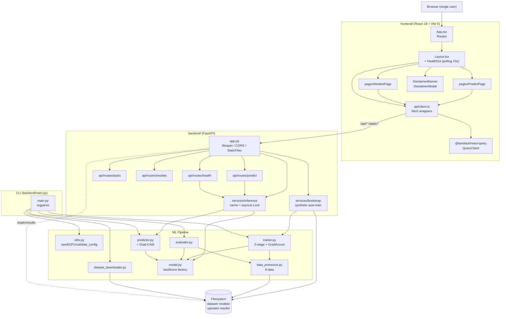

## 2. Class Diagram (Backend)

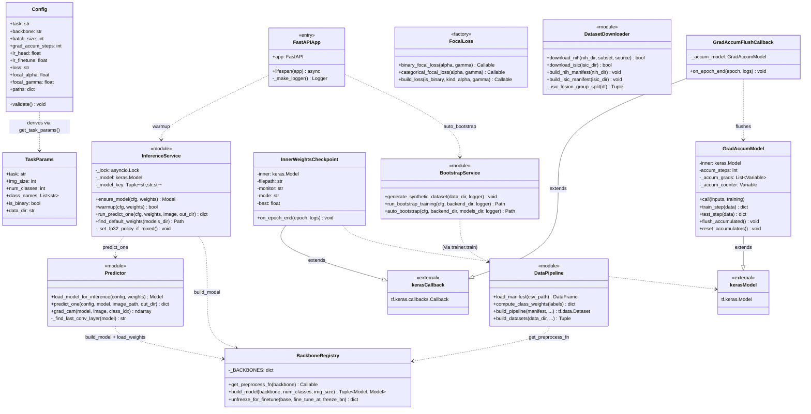

## 3. Class Diagram (Frontend, simplified)

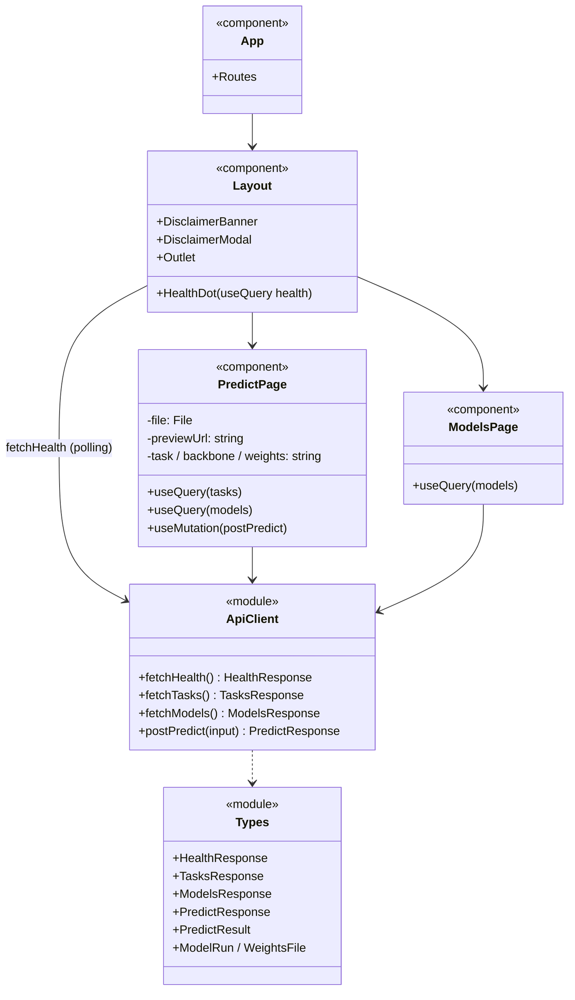

## 4. Sequence — Server Startup (`uvicorn app:app`)

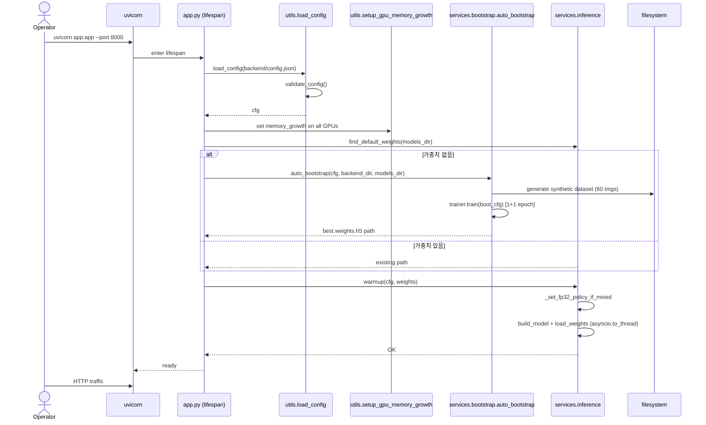

## 5. Sequence — Predict (POST /api/predict)

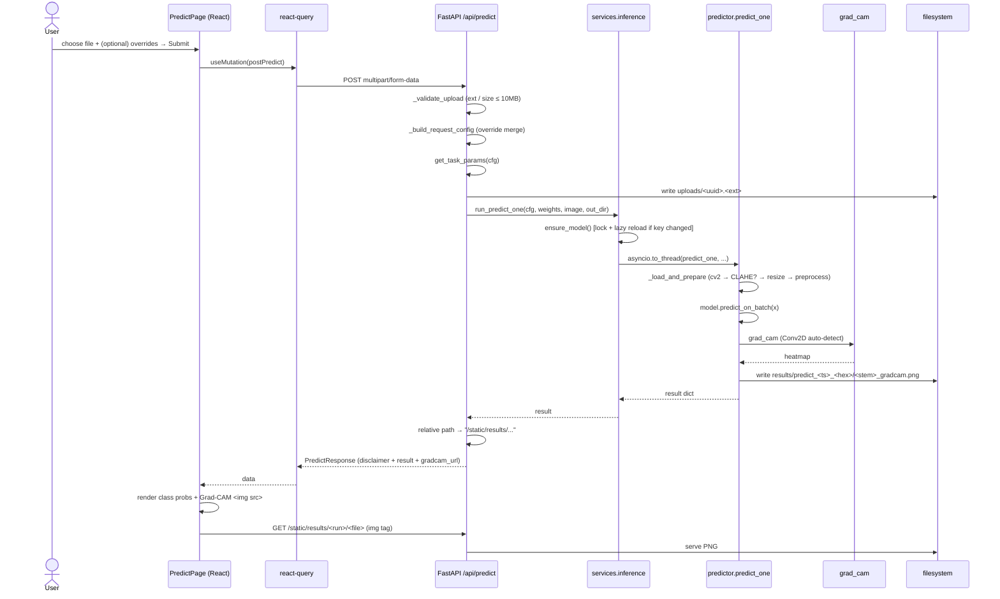

## 6. Sequence — Training CLI (`--mode train`)

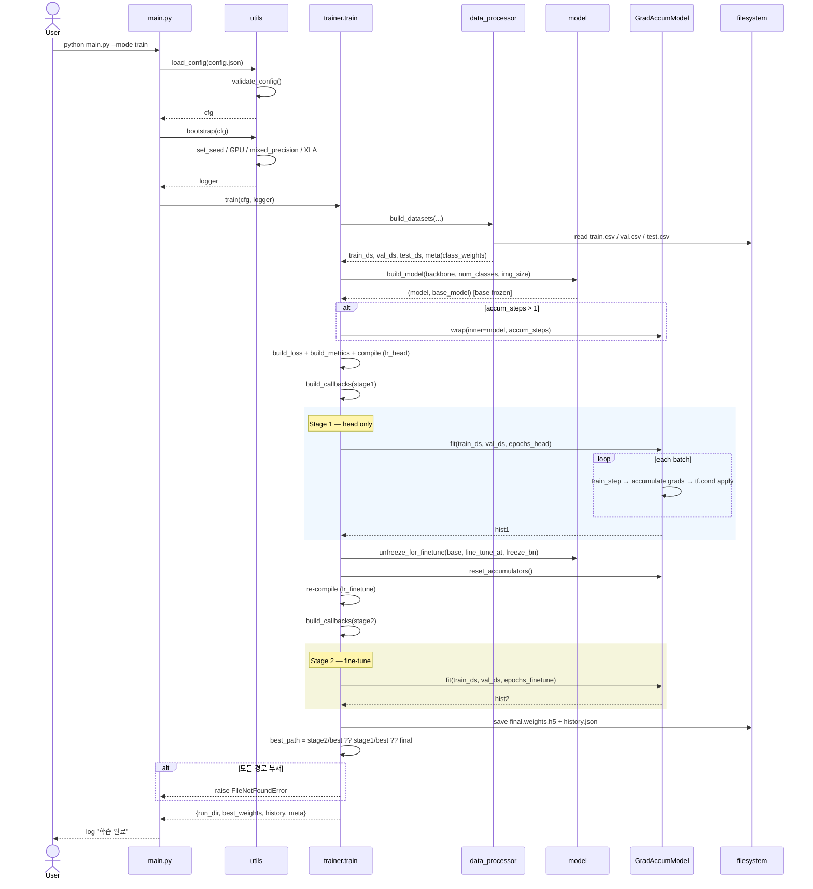

## 7. Sequence — Dataset Download (ISIC)

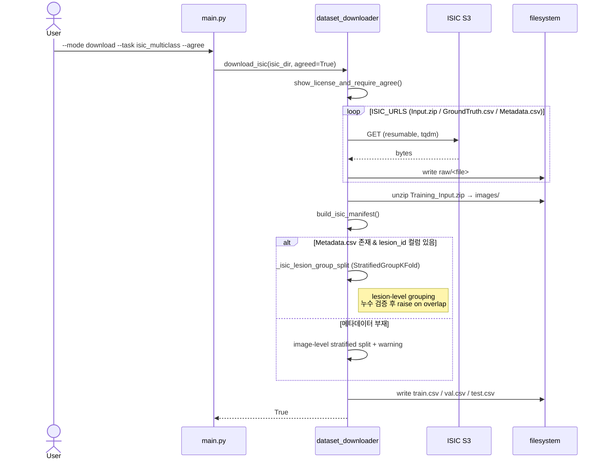

## 8. State — Inference Model Cache

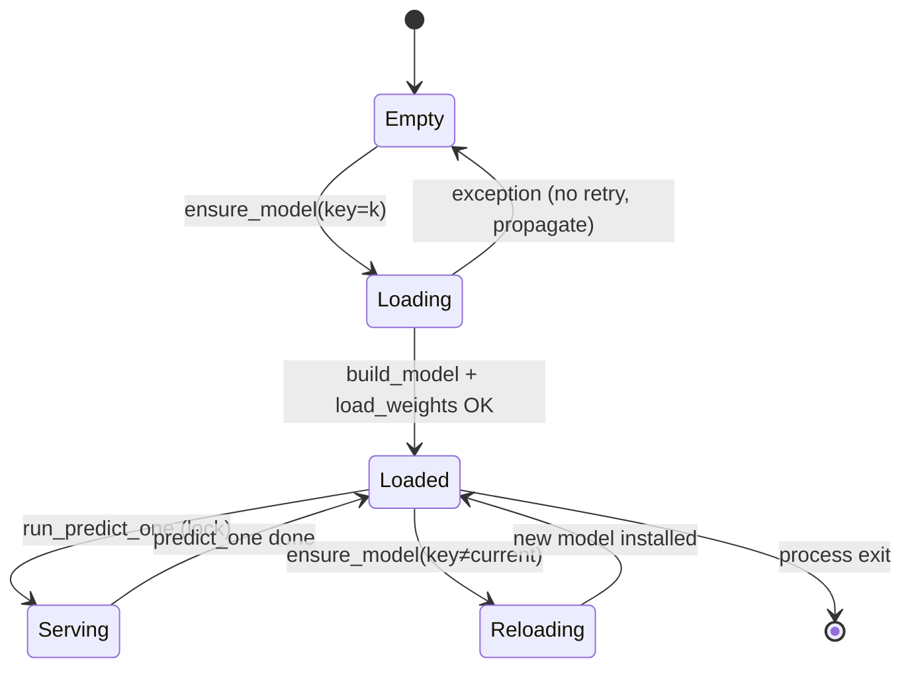

## 9. State — Trainer Stage Transition

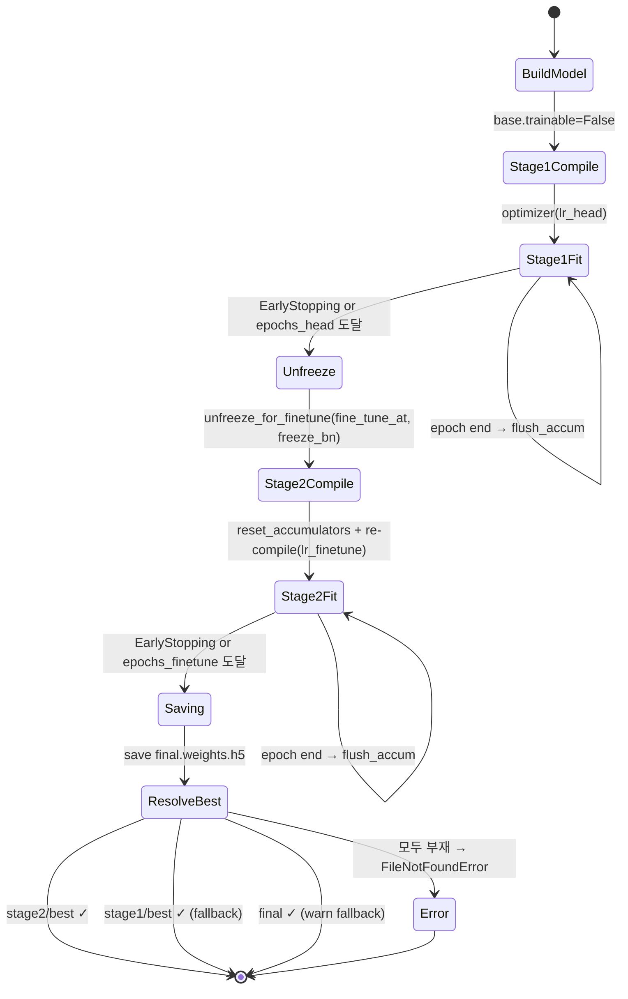

## 10. Activity — Data Pipeline (한 샘플 처리)

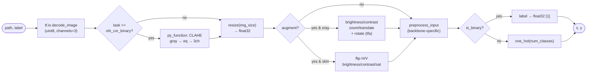

## 11. Activity — Predict Request End-to-End

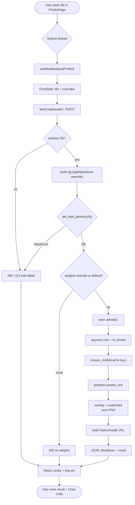

## 12. Deployment View

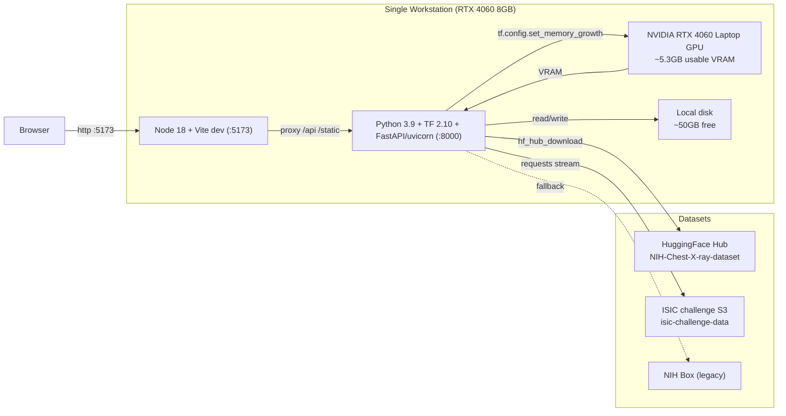
