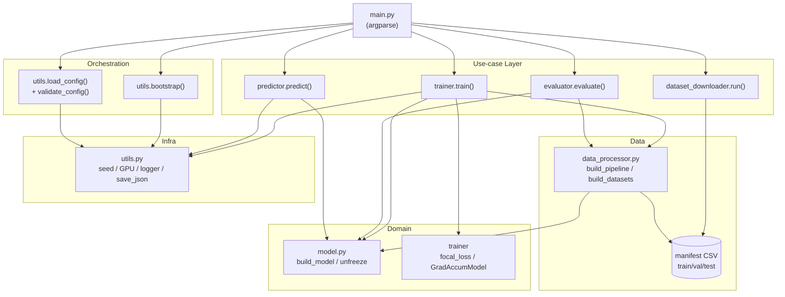
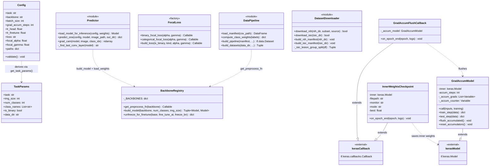
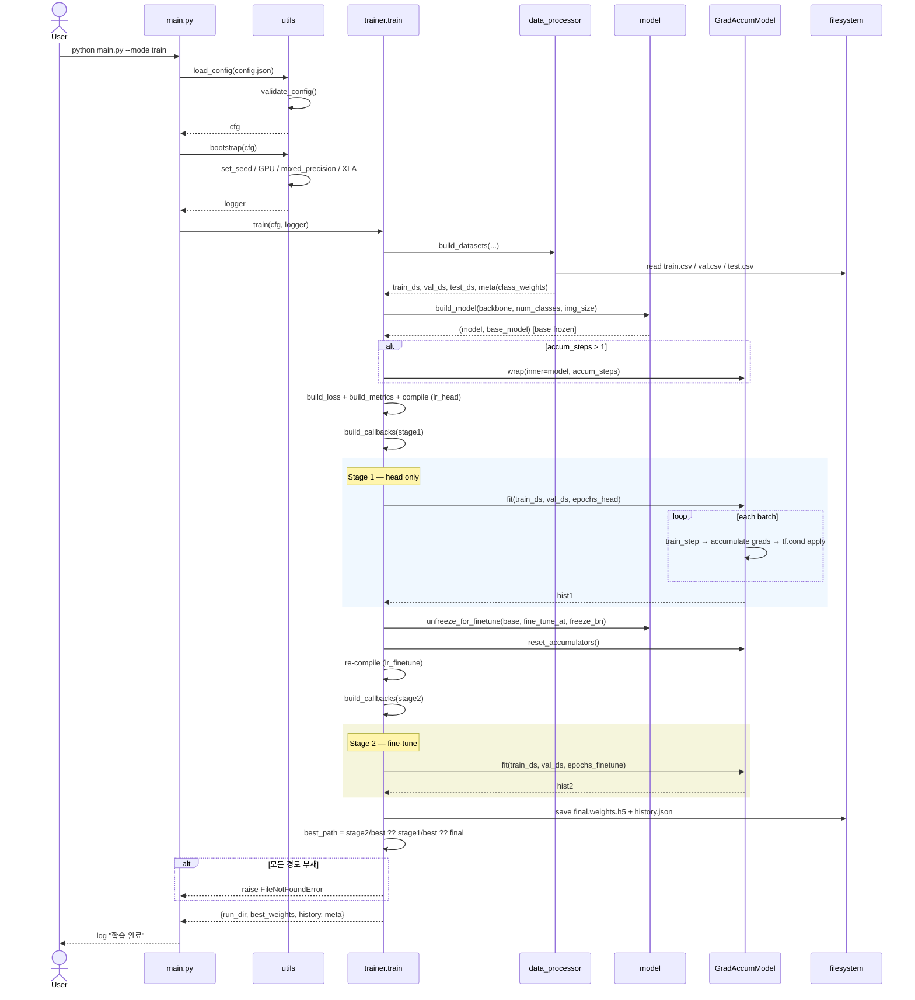
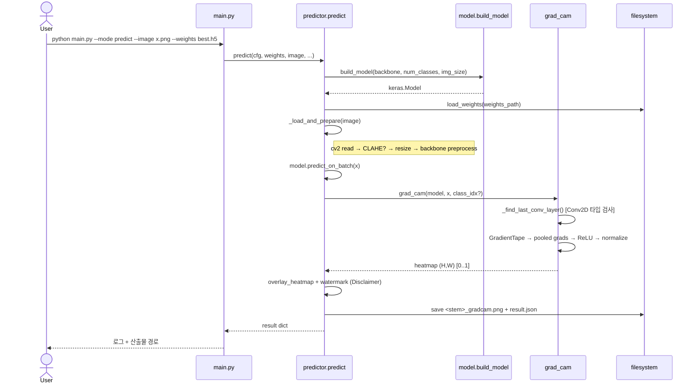
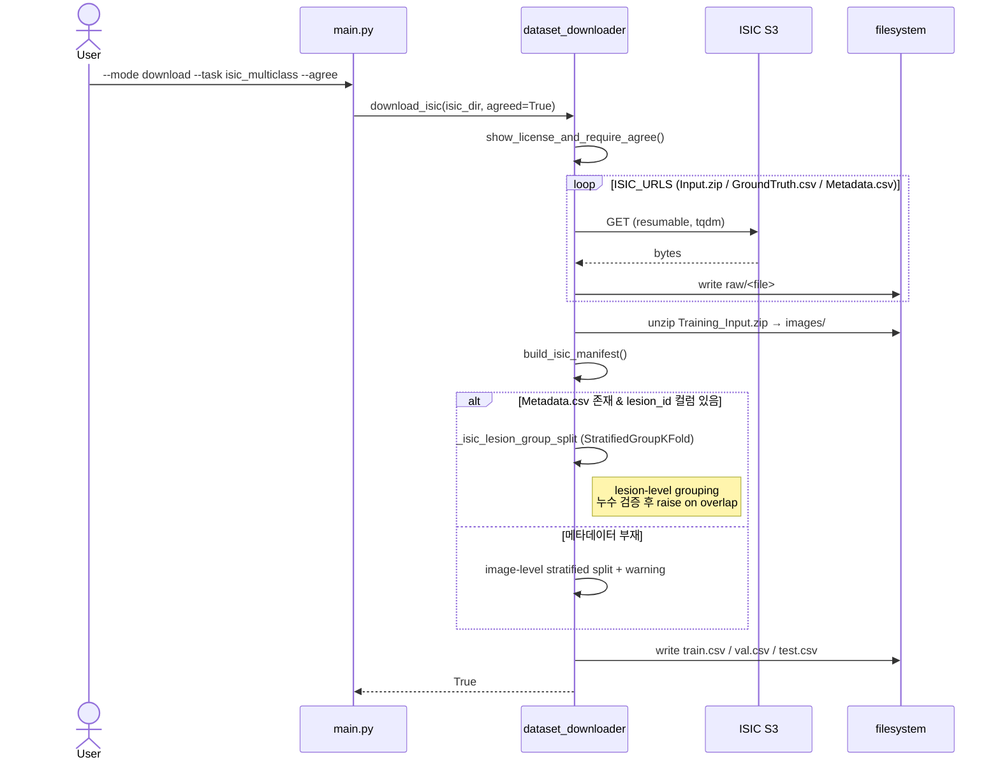
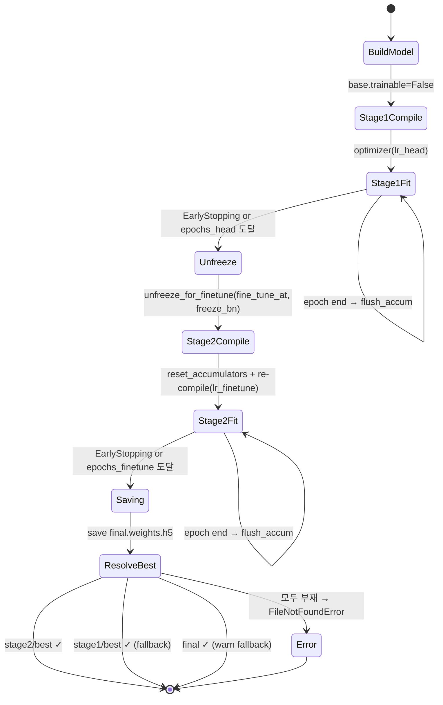
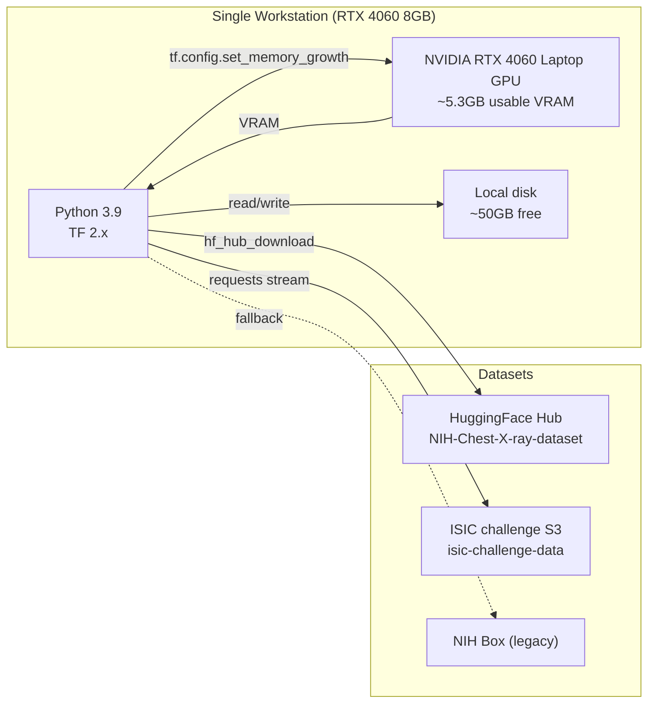

# UML Diagrams

> Mermaid 기반 다이어그램. GitHub/IDE 미리보기에서 그대로 렌더링된다.

## 1. Component Diagram

## 2. Class Diagram

## 3. Sequence — Training (`--mode train`)

## 4. Sequence — Inference + Grad-CAM (`--mode predict`)

## 5. Sequence — Dataset Download (ISIC)

## 6. State — Stage Transition (Trainer)

## 7. Activity — Data Pipeline (한 샘플 처리)

## 8. Deployment View

